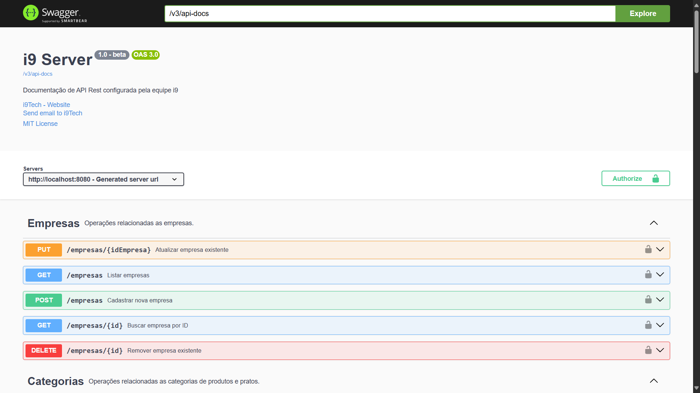
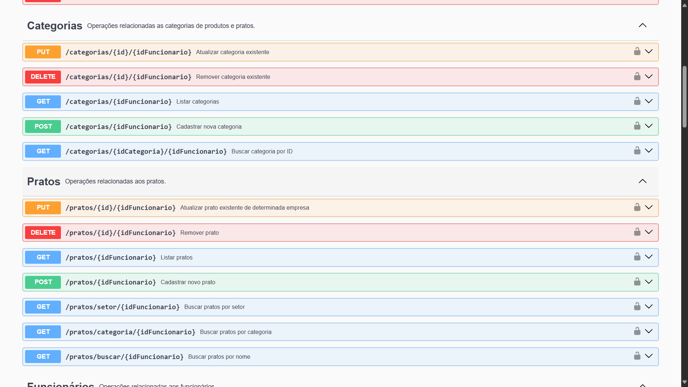
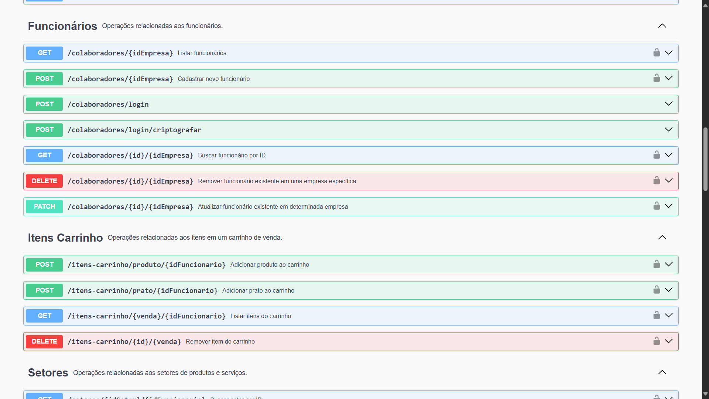
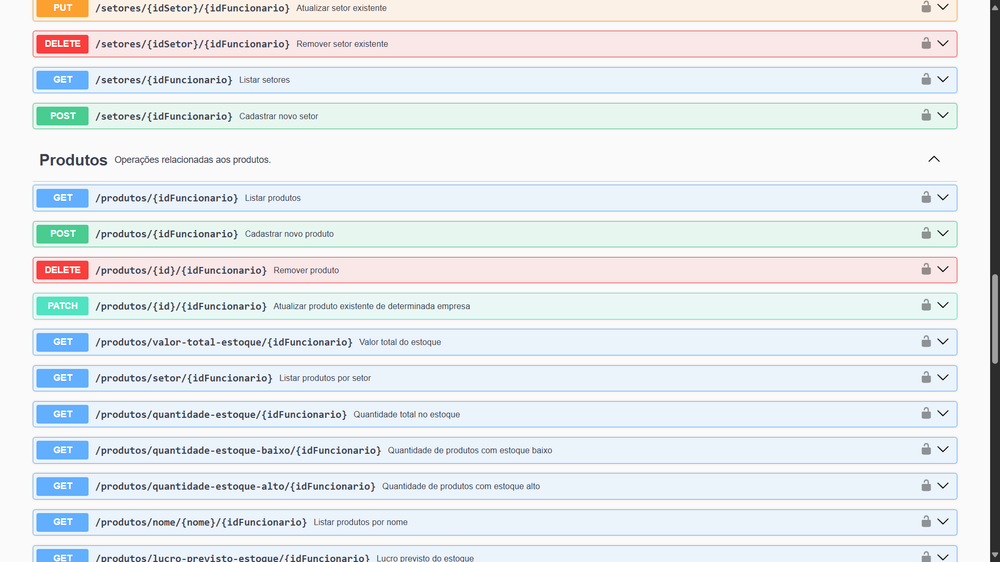
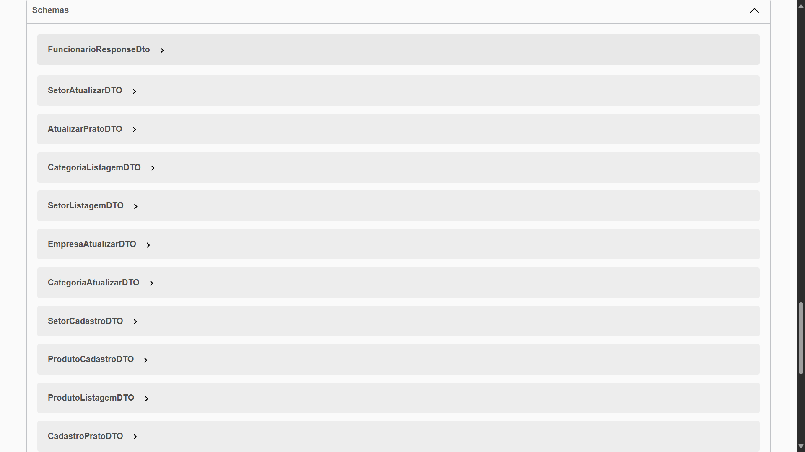
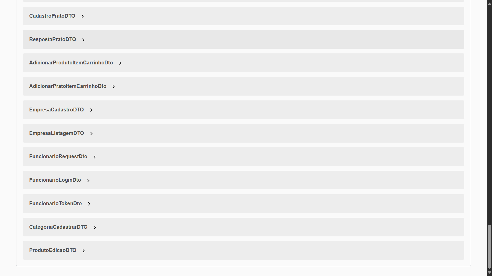

# 🖥️ Servidor i9

### 🌟 Boas vindas!
Esse é o repositório da **i9 Tech** referente aos servidores de nosso sistema. Esse repositório tem como propósito **armazenar** toda nossa **regra de negócio** junto a **camadas de segurança** e **fluxos de funcionamento**, tudo em **um só servidor**. Cada nova implementação é desenvolvida em uma nova branch, para que não haja conflitos na aplicação final, então o que estiver presente na branch principal será o conteúdo mais atualizado e homologado.

***

## 📋 Requisitos de Uso
Para utilizar nosso sistema em sua máquina, é preciso instalar alguns softwares e máquinas. Para desenvolvimento desse servidor, foram utilizados:
- IntelliJ IDEA - IDE para desenvolvimento de códigos
- Java 21 - versão do Java para melhor compilação
- SDK 21
- Springboot 3.4.1
- Maven 3.9.9 para rodar dependências

<br/>

***

### 🧳 Dependências
Além das ferramentas de desenvolvimento, é possível encontrar as seguintes dependências em nosso servidor:
- Springboot 
- H2 Database
- Validation
- Lombok
- Swagger
- JSON Web Token
- Spring Security
- MySQL

<br/>

***

### 🔑 Acesso a Aplicação
Para acessar nossa aplicação, siga os passos:
1. Clone o repositório:
```sh
git clone https://github.com/i9-tech/i9-application.git
```
2. Acesse o diretório `i9-server`
```sh
cd i9-application
```
3. Acesse o diretório `estoque-de-produtos-crud`
```sh
cd estoque-de-produtos-crud
```
4. Abra o arquivo `pom.xml` ou busque o diretório em sua IDE de preferência

5. Espere as dependências serem carregadas para que então possa executar a aplicação

6. Acesse a classe `i9Application` e aperte o play (símbolo verde na linha 7 e aguarde a aplicação iniciar)

7. Pronto! A aplicação estará rodando com sucesso na `porta 8080` do seu `localhost`!

8. Para acessar, basta digitar `localhost:8080` em seu navegador que verá uma mensagem em tela branca!

<br/>

***

## ⚠️ ATENÇÃO
Para utilizar qualquer função dentro de nosso servidor, será necessário informar um `token de segurança` a partir de um **login**. existe um usuário padrão que é criado para testes, é possível utilizar seu login com as credenciais:

- 000.000.000-00
- 00000000000@teste

Esse usuário pertence a uma empresa fictícia e não tem nenhuma ligação com clientes reais da aplicação, não causando danos em testes de uso. 

<br/>

***

## 📚 Entidades
As entidades presentes no servidor são:
- Categoria
- Empresa
- Funcionário
- ItemCarrinho
- Pedido
- Prato
- Setor
- Venda

<br/>

***

## 📂 Pacotes
Os pacotes presentes em nossa aplicação são:

- `Config`: Armazena configurações de segurança e Swagger

- `Controller`: Armazena os controladores do servidor, responsáveis por receber requisições em DTO, converter para entidade e devolver a resposta novamente em DTO, além de seus DTOs e mapeadores que fazem conversão dos dados

- `Entity`: Armazena as entidades do sistema

- `Exception`: Armazena os erros do sistema

- `Repository`: Armazena a camada de repositório do servidor, responsável pela consulta direta ao banco de dados

- `Service`: Armazena a camada de serviço do servidor, recebendo entidades e fazendo a consulta de dados ou jogando exceções 

<br/>

***

## 🧪 Exemplos de Uso
Ao testar algumas rotas de nosso servidor, você irá se deparar ou com um corpo em **JSON de resposta**, um **status HTTP** ou uma **mensagem de erro** vinda de uma exceção. Alguns exemplos de resposta de sucesso são:

1. Cadastrar Empresa (`POST /empresas`)
```json
{
	"id": 4,
	"nome": "Nome da Empresa",
	"cnpj": "12345678901234",
	"endereco": "Rua Exemplo, 123",
	"dataCadastro": "2025-04-25",
	"ativo": true
}
```

2. Cadastrar Funcionário (`POST /colaboradores/1`)
```json
{
	"nome": "Pedro",
	"cpf": "133.356.389-00",
	"cargo": "Cozinheiro",
	"dataAdmissao": "2025-04-25T00:00:00.000+00:00",
	"acessoSetorCozinha": true,
	"acessoSetorEstoque": true,
	"acessoSetorAtendimento": false,
	"proprietario": false
}
```

3. Realizar Login (`POST /colaboradores/login`)
```json
{
	"userId": 1,
	"empresaId": 1,
	"nome": "João Silva",
	"token": "eyJhbGciOiJIUzUxMiJ9"
}
```

4. Editar Permissão de Funcionário (`PATCH /colaboradores/1/1`)
```json
{
	"nome": "Pedro",
	"cpf": "133.356.389-00",
	"cargo": "Cozinheiro",
	"dataAdmissao": "2025-04-25T00:00:00.000+00:00",
	"acessoSetorCozinha": false,
	"acessoSetorEstoque": false,
	"acessoSetorAtendimento": true,
	"proprietario": false
}
```

5. Remover Funcionário (`DELETE /colaboradores/1/1`)
```http
204 No Content
No body returned for response
```

6. Remover Empresa (`DELETE /empresas/1`)
```http
204 No Content
No body returned for response
```


<br/>

***

## 🔐 Camada de Segurança

A camada de segurança do sistema é baseada em **Spring Security** com autenticação via **JWT (JSON Web Token)**. Ao fazer login, o usuário recebe um `token JWT assinado`, que deve ser enviado em cada requisição no cabeçalho `Authorization`. O token é validado por um filtro personalizado, e, se for válido, o usuário é **autenticado automaticamente**. O controle de acesso aos endpoints é feito com base nos papéis definidos no token. Além disso, utilizamos boas práticas como **expiração de tokens**, **senhas com hash** seguro (BCrypt) e **rotas públicas configuradas** separadamente das protegidas.

<br/>

***

## 📖 Swagger
Caso deseje obter mais detalhes da aplicação, ao executá-la, basta acessar a url de documentação para que possa entender melhor sobre todas as entidades e rotas do sistema. Se deseja ler essas informações, acesse o link:

`http://localhost:8080/swagger-ui/index.html#/`

Nele, é possível ver algumas informações do sistema como nas imagens abaixo:














<br/>

***

## 🔗 Integração

Caso deseje testar a aplicação e dados gerados por meio de uma interface gráfica, a i9 oferece um repositório com toda a aplicação desenvolvida para o front-end do projeto. Se deseja clonar o repositório, acesse o link:

https://github.com/i9-tech/i9-application

Nele, é possível ler o passo a passo de como realizar a instalação do repositório e rodar localmente.

<br/>

***

## 📜 Licença

Este projeto está licenciado sob a Licença MIT. Isso significa que você pode usá-lo, modificá-lo e distribuí-lo livremente, desde que mantenha os avisos de copyright e a licença original.

Consulte o arquivo [LICENSE](./LICENSE) para mais detalhes.

i9 Tech 2025 &copy; Todos os direitos reservados.
